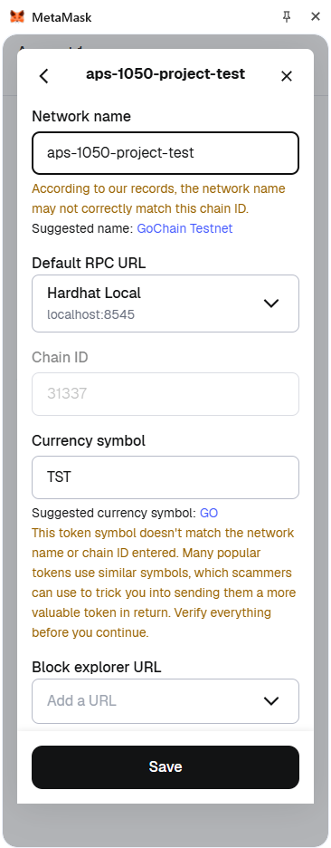
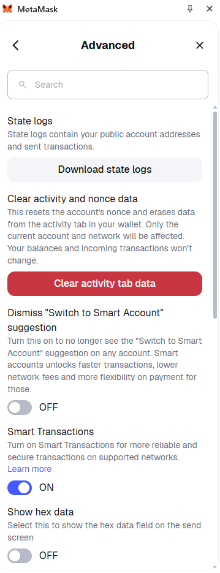

# Sports Betting dApp

### This dApp is build on top of the example project `hardhat-boilerplate`. See the original `README.md` file at `hardhat-boilerplate_README.md`. Build on the example `hardhat-boilerplate` project on GitHub: [https://github.com/NomicFoundation/hardhat-boilerplate](https://github.com/NomicFoundation/hardhat-boilerplate) 

## Startup Instructions
1. Install `git` from their official website [https://git-scm.com/install/](https://git-scm.com/install/)
2. Make a new directory somewhere on your computer, navigate to that folder in the command line, and `git clone` this repository into that folder.
    ```shell
   mkdir aps1050
   cd aps1050
   git clone https://github.com/Zeryllium/aps1050-w26-project.git
   ```
3. Open up the project using [IntelliJ IDEA](https://www.jetbrains.com/idea/download/) or another IDE of your choice.
4. Open a console running in the root directory of this project.
    ```shell
    cd /path/to/aps1050-w26-project
    ```
5. Run the following command
    ```shell
    npm run setup
    ```
6. Verify that the installation worked by checking for the presence of these two directories:
   1. `./node_modules`
   2. `./frontend/node_modules`
   
## Run Instructions
The Frontend polls the Oracle for MatchIds every 10 seconds and fetches MatchData pertaining to those matches every 2 seconds. You can change this interval if you would like by modifying `HandleMatchInfo.js` in the Interval initialization `findNewMatches` and `updateMatchData`.
1. Open **THREE SEPARATE CONSOLES** and run the following commands in the order that is given. Remember to replace `/path/to/` with your actual path to the project root.
2. **Console A**  
    ```shell
    cd /path/to/aps1050-w26-project
    npx hardhat node
    ``` 
3. **Console B**
    ```shell
    cd /path/to/aps1050-w26-project
    npx hardhat clean
    npx hardhat compile
    npx hardhat run scripts/deploy.js --network localhost
    ```
4. **Console C**    
    ```shell
    cd /path/to/aps1050-w26-project/frontend
    npm run dev
    ```
5. Open a browser with the MetaMask addon and configure the Network for this. 
   <br/><br/>
6. Navigate to the frontend webpage [http://localhost:5173/](http://localhost:5173/)
7. Connect MetaMask to the webpage by clicking the button.
8. You may press the "Faucet" button to obtain 1 ETH and 100 LIT for use in this dApp.
9. Add new matches to the blockchain through the Oracle in <br/>**Console B**
   ```shell
   npx hardhat run scripts/sample_run_0.js --network localhost
   ```
10. Go back to the website and place bets. You may swap MetaMask wallets and accounts to play the role of multiple users. **You must clear the page cache and reload the page with `Ctrl+F5` if you choose to switch accounts.** <br/><br/> **Note: There is a small bug where the frontend displays incorrect match data when switching accounts for the first time. Updating the states of the matches in Step 11 will fix this issue for the rest of the session.**<br/><br/>  
11. Update the state of the matches in the blockchain through the Oracle in <br/>**Console B**
   ```shell
   npx hardhat run scripts/sample_run_1.js --network localhost
   ```
12. Observe that matches 1, 2, and 3 have changed state from *Pending* to *Underway*. If you reload the page at this point, matches that you have not bet on and are not *Pending* will no longer be tracked for your account. Observe that you can no longer place bets on matches not in *Pending*.
13. Update the state of the matches in the blockchain through the Oracle in <br/>**Console B**
   ```shell
   npx hardhat run scripts/sample_run_2.js --network localhost
   ```
14. Observe that matches 1, 2, and 3 have changed state from *Underway* to *Finalized*. Also observe that match 4 has changed state from *Pending* to *Underway*.
    1. Bets that you have won will pay out a proportional share of the total pot, minus a house fee (2%). If you did not switch accounts and add bets to the other side, this payout will always be lower than your initial bet proportional by exactly the house fee.
    2. Bets that you have lost will indicate that you have lost and will not allow you to claim any earnings for those lost bets.
15. Update the state of the matches in the blockchain through the Oracle in <br/>**Console B**
   ```shell
   npx hardhat run scripts/sample_run_3.js --network localhost
   ```
16. Observe that match 4 has changed state from *Underway* to *Finalized*. Also observe that any matches whose winning bets you have claimed have stopped being tracked by the frontend.

## Run Reset Instructions
At the end of each run, you **MUST** do **ALL** the following:
1. Terminate the local hardhat node <br/>**Console A**
   ```shell
   Ctrl+C
   ```
2. Terminate the frontend service <br/>**Console C**
   ```shell
   Ctrl+C
   ```
3. Clear the deployed artifacts <br/>**Console B**
   ```shell
   npx hardhat clean
   ```
4. Clear the browser cache of the webpage with `Ctrl+F5` (It is ok if it says it cannot connect to the webserver. We turned it off in step 2.)
5. **VERY IMPORTANT** Clear the MetaMask activity data **FOR ALL ACCOUNTS** that you used in this demo.
   <br/><br/>
6. Resume at the top of the Run Instructions